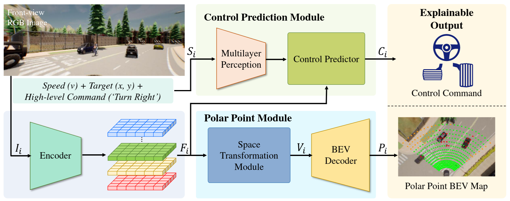

# PolarPoint-BEV
This is the official pytorch implementation of PolarPoint-BEV.



[](https://www.youtube.com/watch?v=apkmM82N9Wo "PolarPoint-BEV")

## Setup
Download and setup CARLA 0.9.10.1 (from [TCP](https://github.com/OpenDriveLab/TCP))
```
mkdir carla
cd carla
wget https://carla-releases.s3.eu-west-3.amazonaws.com/Linux/CARLA_0.9.10.1.tar.gz
wget https://carla-releases.s3.eu-west-3.amazonaws.com/Linux/AdditionalMaps_0.9.10.1.tar.gz
tar -xf CARLA_0.9.10.1.tar.gz
tar -xf AdditionalMaps_0.9.10.1.tar.gz
rm CARLA_0.9.10.1.tar.gz
rm AdditionalMaps_0.9.10.1.tar.gz
cd ..
```

Clone this repo and build the environment

```
git clone https://github.com/lab-sun/PolarPoint-BEV.git
cd PolarPoint-BEV
conda env create -f environment.yml --name PolarPoint-BEV
conda activate PolarPoint-BEV
```


## Dataset
Download the datasets and then extract it in the file of `Data`

The Control Prediction Module of the XPlan network is firstly pre-trained on the dataset from [TCP](https://github.com/OpenDriveLab/TCP)

To train the XPlan network, please refers to [trainset](https://drive.google.com/file/d/1BV7juPDZWJPMduMZSwvXjAmAfEZabnAT/view?usp=sharing) and [valset](https://drive.google.com/file/d/1iObCyK23NPzrhzvR3J1XvHiLZ9tjOimk/view?usp=sharing).

## Pretrained weights：
* Download the pretrained weights and then extract it in the file of `weight`
* The link for pretrained weights is [weight](https://drive.google.com/file/d/1jKBGd5nwtHNjDoT114CoiO1lSBj6tds9/view?usp=sharing).

## Evaluation
The evaluation is performed in the Carla Simulator.

Step1: Launch the Carla server,
```
cd CARLA_ROOT
./CarlaUE4.sh --world-port=2000 -opengl
```
Set the parameters in the ``leaderboard/scripts/run_evaluation.sh``.

Step2: Start the evaluation

```
sh leaderboard/scripts/run_evaluation.sh
```


## Citation
If you found this code or dataset are useful in your research, please consider citing
```
@article{feng2024polarpoint,
  title={PolarPoint-BEV: Bird-eye-view Perception in Polar Points for Explainable End-to-end Autonomous Driving},
  author={Feng, Yuchao and Sun, Yuxiang},
  journal={IEEE Transactions on Intelligent Vehicles},
  year={2024},
  publisher={IEEE}
}
```
